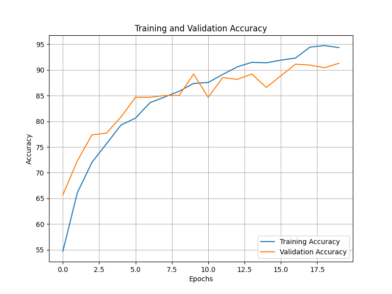
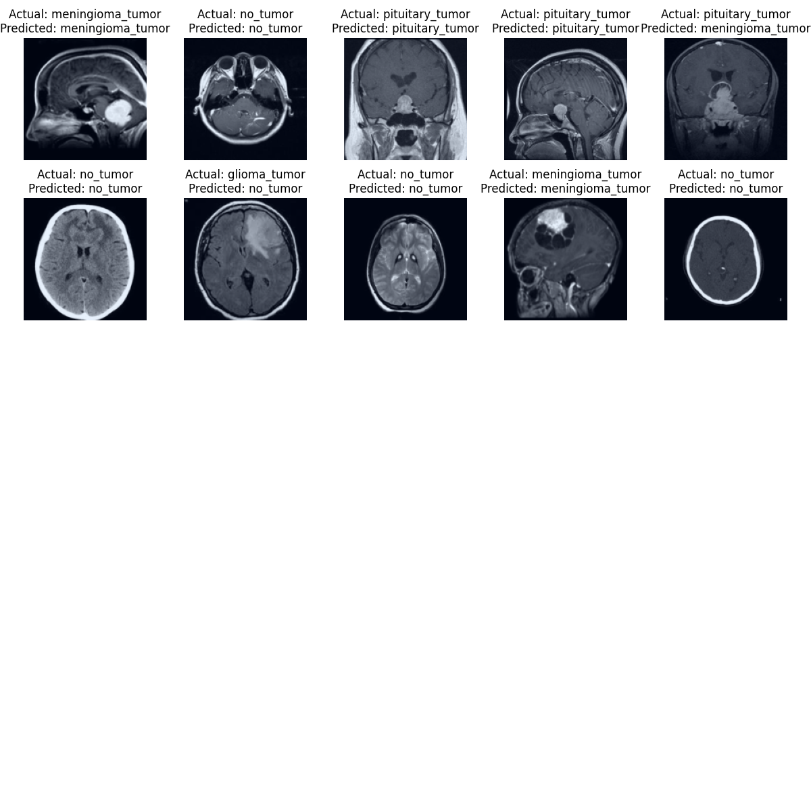

# Brain MRI Tumor Detection and Classification

## Abstract

Brain tumors are a significant health concern, accounting for 85-90% of all primary Central Nervous System (CNS) tumors. Annually, around 11,700 individuals are diagnosed with brain tumors, with a 5-year survival rate of approximately 34% for men and 36% for women. Brain tumors can be benign, malignant, pituitary tumors, etc. Early and accurate diagnosis is crucial for effective treatment and improving patient outcomes. Magnetic Resonance Imaging (MRI) is the most effective technique for detecting brain tumors, generating a substantial amount of image data that is typically reviewed by radiologists. However, manual examination can be prone to errors due to the complexity of brain tumors.

Automated classification techniques using Machine Learning (ML) and Artificial Intelligence (AI) have shown higher accuracy compared to manual methods. This project proposes a system that leverages Deep Learning algorithms, including Convolutional Neural Networks (CNN), Artificial Neural Networks (ANN), and Transfer Learning (TL), to enhance the detection and classification of brain tumors, aiding doctors worldwide.

## Context

Brain tumors present significant challenges due to their complexity and variability in size and location. Accurate analysis of MRI scans often requires specialized neurosurgeons, and in developing countries, the shortage of skilled professionals makes it challenging to generate timely and accurate reports. An automated cloud-based system can alleviate these challenges by providing consistent and efficient analysis of MRI scans.

## Definition

This project aims to detect and classify brain tumors using CNN techniques as part of a Deep Learning approach.

### Main Task

The main task of this repository involves deploying a machine learning model as an API and creating a web application that interacts with this API. The model API will handle requests from the web application and provide responses. The web application should include input fields for uploading MRI images, a button to trigger predictions, and an area to display the results. The deployment will use Docker containers, FastAPI for the model API, and Streamlit for the web application.

## Model Description
The brain tumor classification model is built using a Convolutional Neural Network architecture designed to classify various types of brain tumors from MRI scans. The model consists of multiple convolutional layers for feature extraction, followed by max pooling layers to downsample the spatial dimensions. Fully connected layers at the end of the architecture enable the final classification into one of four tumor types: glioma, meningioma, pituitary tumor, or no tumor. A dropout layer is included to mitigate overfitting during training, and the model is trained using the Adam optimizer with a cross-entropy loss function. The model is optimized for performance on both validation and test datasets, ensuring high accuracy and reliability in predictions.
You can include the following sections in your README to add the pictures of model training and predictions:

### Model Training Accuracy

The training and validation accuracy of the brain tumor classifier during the training process is illustrated in the following plot:



### Randomly Chosen Predictions

Below are some randomly selected predictions from the test set, showcasing the model's performance on unseen data:



## Features

- **Model API**: Built with FastAPI to handle image uploads and return predictions on brain tumor types.
- **Web Application**: A user-friendly interface created using Streamlit for easy interaction with the model API.
- **Dockerized Deployment**: Both the API and web application are packaged in Docker containers for seamless deployment and scalability.
- **Network Management**: Utilizes Docker networks to facilitate communication between services.

## Prerequisites

- Docker installed on your machine.
- Basic understanding of command line interface and Docker commands.

## Installation

### First Option to Run Project

1. Clone the repository:
   ```bash
   git clone https://github.com/kezouke/MRI-Diagnosis-API.git
   ```
2. Change into the project directory:
   ```bash
   cd MRI-Diagnosis-API
   ```
3. Create a Docker network:
   ```bash
   docker network create my_network
   ```
4. Build the Docker images:
   ```bash
   docker build -t fastapi-app -f code/deployment/api/Dockerfile .
   docker build -t streamlit-app -f code/deployment/app/Dockerfile .
   ```
5. Run the FastAPI service:
   ```bash
   docker run -d --name fastapi-service \
     --network my_network \
     -v "$(pwd):/usr/src/app" \
     fastapi-app
   ```
6. Run the Streamlit app:
   ```bash
   docker run -p 8501:8501 \
     --network my_network \
     -v "$(pwd):/usr/src/app" \
     streamlit-app
   ```

### Second Way to Run Project

1. Clone the repository:
   ```bash
   git clone https://github.com/kezouke/MRI-Diagnosis-API.git
   ```
2. Change into the project directory:
   ```bash
   cd MRI-Diagnosis-API
   ```
3. Run the application using Docker Compose:
   ```bash
   docker-compose -f code/deployment/docker-compose.yml up --build
   ```

## Usage

Once the services are up and running:

- Access the Streamlit web application in your browser at `http://localhost:8501`.
- Upload an MRI image and click the "Predict" button to receive a classification of the brain tumor type.
